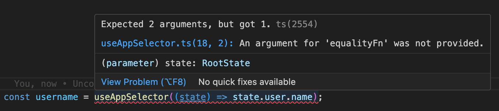

# Redux useAppSelector and equality functions

2023-03-19

Redux Toolkit [docs for TypeScript](https://redux-toolkit.js.org/tutorials/typescript#define-typed-hooks) recommend wrapping `useSelector` to create a `useAppSelector` that has your store's `state` type predefined like this:

```typescript
export const useAppSelector: TypedUseSelectorHook<RootState> = useSelector;
```

This means that instead of having to do this:

```typescript
const someValue = useSelector((state: RootState) => state.someSlice.someValue);
```

You can just do:

```typescript
const someValue = useAppSelector((state) => state.someSlice.someValue);
```

This is nice, that it makes it so you don't need to type `: RootState` into every `useSelector`, but personally like to take it a step further by modifying `useAppSelector` such that the "equality function" is not an optional second parameter, but a required one. I like this method because it forces you to be explicit about your intentions. Here's how it can be setup:

```typescript
import { useSelector } from 'react-redux';
import type { RootState } from '../store';

export type EqualityFn = <T>(a: T, b: T) => boolean;

/**
 * Same as react-redux built in type 
 * TypedUseSelectorHook, except equalityFn is required
 */
export type AppTypedUseSelectorHook = <TSelected>(
	selector: (state: RootState) => TSelected,
	equalityFn: EqualityFn
) => TSelected;

/**
 * Wrap the built-in useSelector, but make equalityFn required
 */
export const useAppSelector: AppTypedUseSelectorHook = (
	selector,
	equalityFn: EqualityFn
) => {	
	return useSelector(selector, equalityFn);
};
```

Now when you try to use `useAppSelector` without an equality function, you get a warning like:



I also like to do two more things with this:

1. Re-export reference-equality, shallow-equals, and deep-equals functions from the same file `useAppSelector` is in.
2. Make an ESLint rule preventing using `useSelector` or any equality functions NOT from my `useAppSelector` file, which can be done like:

```javascript
const eslintRules = {
	'no-restricted-imports': ['error', {
		paths: [
			{
				name: 'react-redux',
				importNames: ['useSelector', 'shallowEqual'],
				message: 'Use useAppSelector() instead of useSelector(), and refEqual()/shallowEqual()/deepEqual() from useAppSelector.ts versus other locations. These functions provide better app-specific defaults.'
			},
			{
				name: 'assert',
				importNames: ['deepEqual'],
				message: "Use 'useAppSelector.ts/deepEqual'."
			}
		]
	}],
};
```

This prevents accidentally using the non-app-specific `useSelector`, as well as not going through your re-exported equality functions. The benefit of the former is fairly obvious: you made the app-specific selector, and you want people on your team to use it. The benefit of the restricting to using the re-exported equality functions is less obvious: it allows you to easily swap out equality functions at any point with a change in one file, versus changing it throughout your codebase. This can be useful if you want to try out a [faster deep equality function](https://www.npmjs.com/package/fast-deep-equal), but it can also be useful in development when you want to temporarily patch an equality function while investigating a bug or performance issue.
